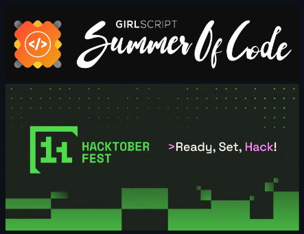

# 🎮 Collect Your GamingTools 🕹️

A **responsive and dynamic website** to showcase the best gaming accessories for every gamer.

  

  

---

## ✨ Features

* 🗂️ **Dynamic Navigation Menu** – Toggle visibility, designed for seamless use across all screen sizes.
* 🛒 **Product Display** – View gaming products with prices, discounts, and a **Buy Now** CTA.
* 🌐 **Social Links** – Quick access to Facebook, Twitter, and Instagram.
* 📱 **Responsive Design** – Smooth navigation on mobile, tablet, and desktop.
* 🎨 **Cool Animations** – Hover effects, fade-ins, and smooth transitions to enhance UX.
* ⚡ **Fast Performance** – Optimized for speed across devices.

  

  

---

## 🧰 Tech Stack

**Frontend:**   

**Backend & Infra:**    

* ⚙️ **Node.js & Express** – REST API and server logic
* 🍃 **MongoDB** – Product, user & order data
* 🐳 **Docker** – Easy containerized deployment

  

  

---

## 🖼️ Screenshots / Previews

> Add screenshots/GIFs for navbar toggle, product cards, and mobile views.

  

  

  

---

## 👥 Maintainers / Contributors

|     Name     |                   Role                  |                         Links                         |
| :----------: | :-------------------------------------: | :---------------------------------------------------: |
| **Sriram B** | Web Developer · Open Source Contributor | [LinkedIn](https://www.linkedin.com/in/sri-ram-027-/) |

  

  

---

## 🧭 Community & Events

Proudly part of **GSSoC-EXT'24** & **Hacktoberfest 2024**! 🚀✨

  

  

---

> *Happy coding, and may your FPS stay high!* 🧪🔥
